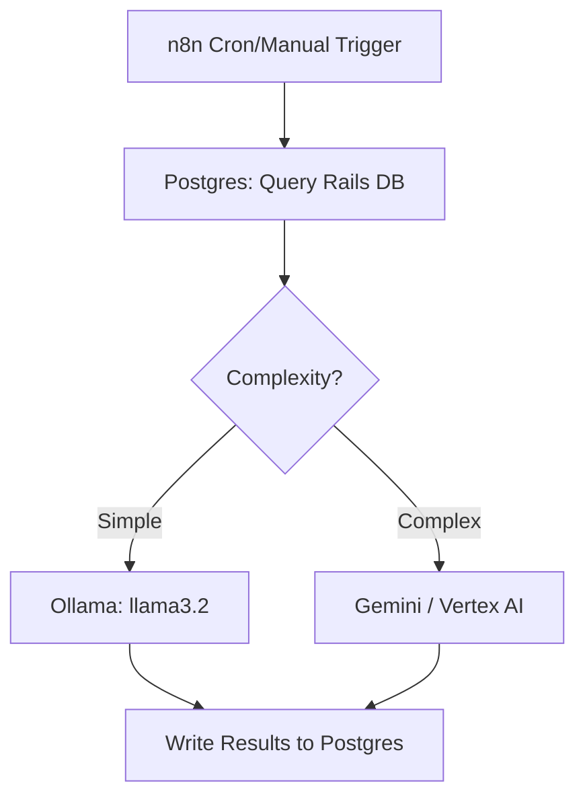

# GENERAL — Project Context & Agent Rules

## What This Project Is

A **self-hosted local AI analytics stack** that uses n8n as the orchestration layer to
pull schema and runtime data from a Ruby on Rails application's PostgreSQL database,
analyze the performance of a companion **sql-agent web-app**, and surface insights via
automated workflows.

The stack runs as Docker Compose on **macOS** (inside a Docker-in-Docker Linux dev
container). The eventual target is **Google GKE**, but that is a future concern.

> **Prime directive: Keep it simple. Solve today's problem. Refactor when needed.**

---

## Stack at a Glance

| Component | Role | Notes |
|-----------|------|-------|
| **n8n** | Workflow orchestration & AI agents | Manual/cron triggers; UI-driven |
| **Ollama** | Local LLM inference | Fast/cheap tasks; runs in Docker |
| **Google Gemini / Vertex AI** | Cloud LLM inference | Hard reasoning tasks |
| **PostgreSQL (local test)** | Rails app DB (target) | Also n8n's own metadata DB |
| **Python** | Primary scripting/tooling language | Used for data transforms, helpers |

Refer to the skill files in `.agents/skills/**/` for detailed configuration:
- `skill-n8n.md` — n8n workflow design, agent patterns, security, observability
- `skill-ollama.md` — Ollama model management, API, GPU, memory tuning
- `skill-n8n-ollama-postgres-docker.md` — Docker Compose integration of all three
- `skill-agno.md` - Working with the Agno agents SDK

---

## Dev Environment

- **Host OS**: macOS
- **Dev container**: Docker-in-Docker Linux container (VS Code dev container or similar)
- **Primary language**: Python
- **Key services**: All run inside Docker Compose; communicate via Docker bridge network
- **Ollama in Docker**: Credential Base URL in n8n → `http://ollama:11434`
- **Ollama on Mac host** (if not in Docker): `http://host.docker.internal:11434`

### LLM Provider Selection Heuristic

| Task Type | Provider |
|-----------|---------|
| Simple classification, summarization, formatting | Ollama (local model) |
| Retrieval, embedding | Ollama (`nomic-embed-text`) |
| Complex reasoning, multi-step analysis, code gen | Google Gemini / Vertex AI |
| Anything involving Rails schema introspection | Start with Gemini; fall back to local if latency isn't critical |

---

## n8n Workflow Design Constraints

- All triggers are **manual or cron** — no inbound webhooks are required for now.
- Workflows are built **primarily in the n8n UI by the user**. The agent's role is to:
  - Watch, understand, and document what exists
  - Provide guidance, code snippets, and sub-workflow logic when asked
  - Keep the `notes/` directory up to date with current state
- Sub-workflows are **preferred** over monolithic flows — one workflow, one job.
- Rails DB connection: use the **Postgres node** in n8n with the Docker service name
  as host. Keep Rails DB credentials separate from n8n's own DB credentials.

---

## Directory Layout (Agent Must Respect)

```
zefflow/
├── .agents/
│   ├── GENERAL.md                              # ← this file
│   └── skills/                                 # Skill files (read-only reference)
│       ├── agno/
│       │   └── skill-agno.md
│       ├── n8n/
│       │   └── skill-n8n.md
│       ├── ollama/
│       │   └── skill-ollama.md
│       └── project/
│           └── skill-n8n-ollama-postgres-docker.md
├── .devcontainer/                              # VS Code dev container config
├── .github/                                    # GitHub workflows / config
├── infra/
│   └── Dockerfile                              # Container build for app image
├── n8n/                                        # n8n workflow exports / assets
├── notes/                                      # Agent's EXCLUSIVE long-term memory
│   ├── architecture.md                         # Current architecture + Mermaid diagrams
│   ├── n8n-workflows.md                        # Inventory of n8n workflows
│   ├── changes.md                              # Chronological change log (append-only)
│   └── ...                                     # Additional notes as needed
├── src/
│   └── zeffflow/
│       ├── agents/                             # Agno agent definitions
│       └── config/
│           ├── __init__.py
│           └── app_config.py
├── .env                                        # Secrets — never committed
├── .env.example                                # Committed template
├── .python-version                             # Pinned Python version (uv)
├── docker-compose.yml
├── LICENSE
├── pyproject.toml                              # Python project + deps (uv)
├── README.md
└── uv.lock                                     # Locked dependency versions
```

---

## Agent Operating Rules

### 1 — Notes Directory Is Agent Memory

The `notes/` directory is **exclusively owned by the agent**. It is the single source
of truth for project state between sessions.

- **Always read relevant notes files at the start of a session** to restore context.
- **Always update notes** after any significant action, discovery, or change.
- Write in a dense, information-rich style — optimize for token efficiency, not
  readability. Use bullet points and tables, not prose paragraphs.
- Never delete content from `notes/changes.md` — append only.

### 2 — Track n8n State Without Touching the UI

The user builds workflows in the n8n UI directly. The agent must:
- Ask the user to describe or export any workflow it hasn't seen.
- Maintain `notes/n8n-workflows.md` with the current known inventory:
  - Workflow name, trigger type, status (active/inactive), last known purpose
  - Key nodes (Postgres query, Ollama model, Gemini call, etc.)
- Never assume a workflow is unchanged since last session — confirm before acting.

### 3 — Use Mermaid for Architecture & Flow

When documenting architecture, workflow structure, or data flow, use Mermaid diagrams
in the notes files. This serves two purposes:
1. Keeps the agent's internal model of the system accurate and parseable
2. Gives the user a visual status report they can read without parsing code

Example format in `notes/architecture.md`:



Update diagrams whenever the topology changes.

### 4 — GKE Awareness Without Premature Optimization

The target deployment is GKE, but **do not add Kubernetes manifests, Helm charts, or
GKE-specific config until explicitly asked**. What the agent should do now:
- Prefer named Docker volumes over bind mounts (easier to migrate to PVCs later)
- Keep all config in environment variables (12-factor — already GKE-compatible)
- Avoid hardcoded `localhost` references anywhere
- Note future GKE considerations in `notes/architecture.md` under a `## Future` section
  but do not act on them prematurely

### 5 — Python Conventions

- Target the Python version specified in `pyproject.toml` / `.python-version` if present
- Use `uv` for package management if available; fall back to `pip` + `requirements.txt`
- Follow existing project structure before creating new files
- Prefer stdlib + small focused libraries; avoid large framework dependencies for
  simple scripts

### 6 — Safety & Simplicity Gates

Before taking any action, apply these checks:

| Check | Question |
|-------|---------|
| Necessity | Is this required *right now* or can it wait? |
| Reversibility | Can this be undone easily? If not, confirm with user first. |
| Complexity creep | Does this add a new dependency or abstraction? Justify it. |
| Secret hygiene | Does this touch credentials? Use `.env` and Credential Manager only. |
| DB safety | Is this a write/delete to Rails DB? Confirm with user first. |

---

## Current Project Status

> **Agent: update this section in `notes/architecture.md` as the project evolves.**
> The version here is the bootstrap / day-0 state.

- [ ] Docker Compose stack scaffolded
- [ ] n8n connected to local Postgres (n8n metadata DB)
- [ ] Ollama running with at least `llama3.2` and `nomic-embed-text` pulled
- [ ] Rails test Postgres seeded with sample data
- [ ] First n8n workflow created (Rails DB query → analysis → output)
- [ ] Gemini / Vertex AI credential added to n8n

---

## Quick Reference

```bash
# Start stack (CPU)
docker compose up -d

# Start stack (NVIDIA GPU)
docker compose -f docker-compose.yml -f docker-compose.gpu-nvidia.yml up -d

# Watch logs
docker compose logs -f n8n
docker compose logs -f ollama

# Health checks
curl http://localhost:5678/healthz          # n8n
docker exec ollama ollama ps               # Ollama loaded models
docker exec n8n-postgres pg_isready -U n8n # Postgres

# Backup (run before any significant change)
docker exec -t n8n-postgres \
  pg_dump -U "${POSTGRES_USER}" "${POSTGRES_DB}" > backup_$(date +%F).sql
```
