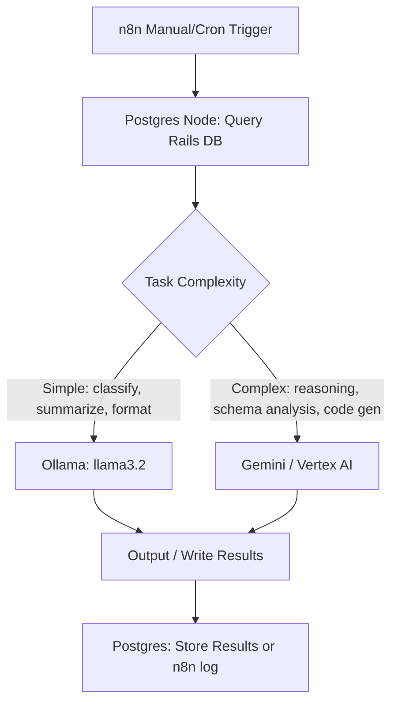

# Architecture

## Overview

Self-hosted local AI analytics stack. n8n orchestrates workflows that query a Rails app's PostgreSQL DB, route analysis to Ollama (simple) or Gemini (complex), and surface insights.

**Runtime target:** Docker Compose on macOS (Docker-in-Docker devcontainer). Future: Google GKE.

---

## Services (docker-compose.yml)

| Service | Image | Container | Port | Volume | Notes |
|---------|-------|-----------|------|--------|-------|
| postgres | postgres:17-alpine | n8n-postgres | 5432 | `postgres_data` | n8n metadata DB; also target for Rails DB |
| ollama | ollama/ollama:latest | ollama | internal only | `ollama_data` | bind `0.0.0.0:11434` inside net |
| ollama-pull | ollama/ollama:latest | ollama-pull | — | — | one-shot; pulls DEFAULT_CHAT_MODEL + DEFAULT_EMBED_MODEL |
| n8n | n8nio/n8n:latest | n8n | 5678 | `n8n_data`, `./shared` | waits for postgres+ollama healthy |

- Network: `dev` bridge; all services communicate by service name
- All config via `.env` (12-factor); no hardcoded localhost
- Named volumes only (GKE PVC-ready)
- `./shared` bind mount → `/data/shared` in n8n for Read/Write File nodes

---

## Data Flow (current)

---

## Python Layer (src/zefflow/)

| Path | Purpose |
|------|---------|
| `src/zefflow/config/app_config.py` | Pydantic-settings model for all `.env` vars; single source of truth |
| `src/zefflow/scripts/compose_up.py` | CLI entry point (`compose-up`) → delegates to `compose_up.sh` |
| `src/zefflow/agents/` | Agno agent definitions (empty — not yet implemented) |

- Python 3.11, managed with `uv`
- Deps: `pydantic`, `pydantic-settings`; dev: `jupyter`, `python-dotenv`

---

## LLM Routing

| Task | Provider | Model |
|------|----------|-------|
| Classification, summarization, formatting | Ollama (local) | `llama3.2` |
| Retrieval, embedding | Ollama (local) | `nomic-embed-text` |
| Complex reasoning, multi-step analysis, code gen | Google Gemini / Vertex AI | TBD |
| Rails schema introspection | Gemini first; Ollama fallback if latency ok | — |

Ollama base URL (from n8n): `http://ollama:11434`
Ollama base URL (Mac host native): `http://host.docker.internal:11434`

---

## Status Checklist

- [ ] Docker Compose stack scaffolded ← **done (code exists; not yet run)**
- [ ] n8n connected to local Postgres (n8n metadata DB)
- [ ] Ollama running with `llama3.2` + `nomic-embed-text` pulled
- [ ] Rails test Postgres seeded with sample data
- [ ] First n8n workflow: Rails DB query → analysis → output
- [ ] Gemini / Vertex AI credential added to n8n
- [ ] Agno agents implemented

---

## Future (GKE — do not act prematurely)

- Replace named Docker volumes with PersistentVolumeClaims
- Replace `./shared` bind mount with a shared PVC or GCS bucket
- Add Ingress + TLS for n8n
- Consider Vertex AI Workbench for Gemini calls
- Pin all image tags before deploying to GKE
