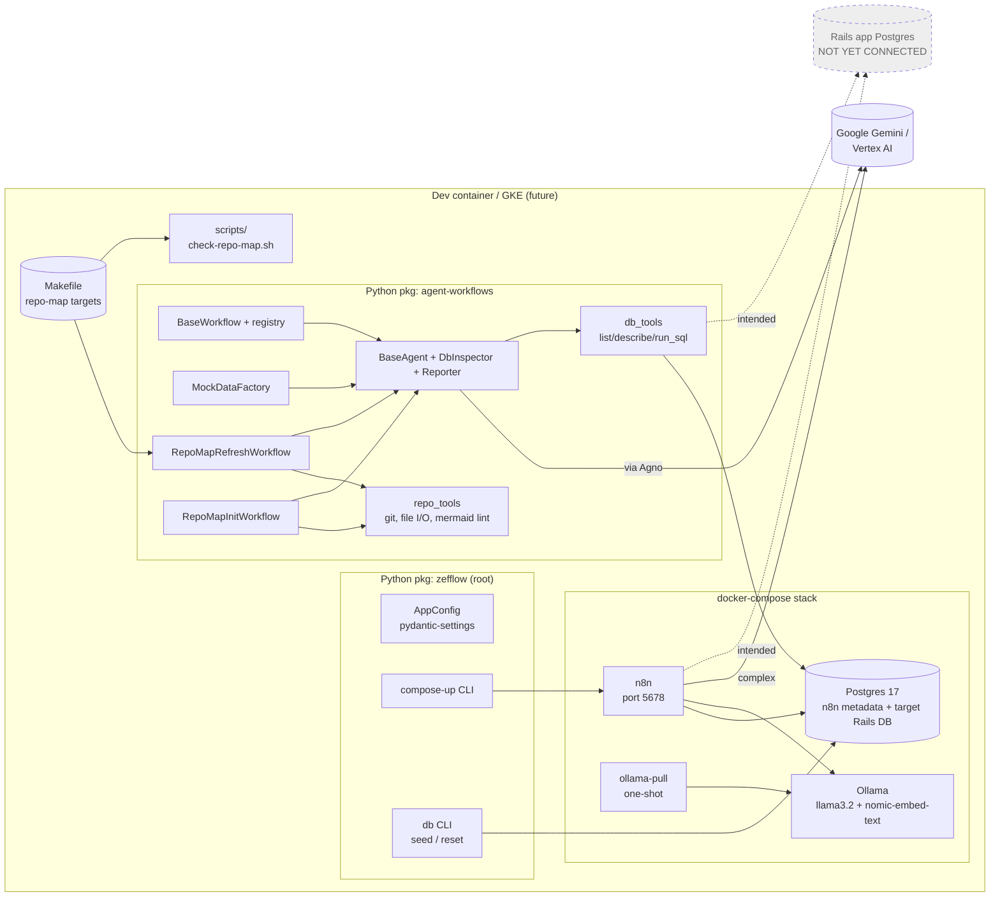

# zefflow — repo overview

> ⚠️ **Maturity: scaffold.** Most of this repo is wiring, config and
> placeholders. The Docker stack is defined but has not been confirmed running;
> no n8n workflows exist in the live stack (the one JSON export is a 8-node
> demo); the Python "agent" layer is two thin packages, neither of which has
> been run end-to-end against real data. **Read this doc as "what the devs
> intend" more than "what it does today."**

---

## 60-second TL;DR

**zefflow** wants to be a self-hosted, agentic analytics layer over a
Ruby-on-Rails Postgres database. The intended stack is:

- **n8n** for workflow orchestration (cron / manual triggers)
- **Postgres** as both the n8n metadata DB and the target Rails DB
- **Ollama** for cheap local LLM calls (classify, summarise, embed)
- **Gemini / Vertex AI** via the **Agno** agent framework for the heavy reasoning
- **Python** glue: a `zefflow` package for infra/config + an `agent-workflows` package for object-oriented Agno workflows

Everything runs in **Docker Compose** today, with **GKE** as a stated future target.

---

## Pre-drill hypothesis vs verified

| | Pre-drill (manifests + READMEs only) | Verified after drilling |
|---|---|---|
| What is this? | Self-hosted n8n + Ollama + Gemini analytics stack | ✅ Correct |
| Active code? | The Python packages look real | ⚠️ Scaffold-level — entrypoints exist but the agent loop has not been demonstrated; tests are smoke-only (no LLM calls) |
| Two Python packages or one? | Looked like a coexisting `zefflow/` (infra) and `src/agent-workflows/` (agent layer) | ✅ Now stable: `agent-workflows/` was moved out of `src/` and committed as a sibling package. The two are intended to coexist but their relationship is not yet wired |
| Build target? | "It's a monorepo" | Yes, but the root `pyproject.toml` only packages `zefflow`; `agent-workflows` is a separate uv project |
| Real n8n workflows? | Implied by `n8n/n8n_export_*.json` and `notes/n8n-workflows.md` | ❌ The export is a **single demo "My workflow"** with 8 nodes; `notes/n8n-workflows.md` explicitly says no workflows exist yet |

The pre-drill read was directionally right but materially overestimated maturity. **This is the most useful signal for the future agent: a manifest-and-README pass alone produces an over-confident summary.**

---

## What's actually in the repo

| Area | State | Evidence |
|---|---|---|
| Docker Compose stack | Defined, not confirmed running | [docker-compose.yml](../../docker-compose.yml), `notes/architecture.md` checklist all unchecked |
| `Makefile` | Defines `repo-map-check`, `repo-map-refresh`, `repo-map-rebuild` targets | [Makefile](../../Makefile) |
| `scripts/` (top-level) | Contains Tier-1 staleness detector (`check-repo-map.sh`) and pre-commit hook installer (`install-hooks.sh`) | [scripts/check-repo-map.sh](../../scripts/check-repo-map.sh), [scripts/install-hooks.sh](../../scripts/install-hooks.sh) |
| `infra/Dockerfile` | **Empty file** | `wc -l` = 0 |
| `compose-up` CLI wrapper | Works, just shells out to `compose_up.sh` | [src/zefflow/scripts/compose_up.py](../../src/zefflow/scripts/compose_up.py) |
| `db` CLI (`zefflow.scripts.db_utils`) | Real: SQLAlchemy ORM + mock seeder for an n8n-side Postgres | [src/zefflow/scripts/db_utils.py](../../src/zefflow/scripts/db_utils.py), `notes/changes.md` confirms it was used 2026-04-28 |
| `AppConfig` (root pkg) | Comprehensive pydantic-settings model for the n8n + Postgres + Ollama + GCP env | [src/zefflow/config/app_config.py](../../src/zefflow/config/app_config.py) |
| `agent-workflows` package | Real Agno scaffold: `BaseWorkflow`, `BaseAgent`, registry, one demo workflow (`daily_db_report`), LLM-backed mock data factory; `pyproject.toml` now correctly packages `scripts/` | [agent-workflows/src/agent_workflows/](../../agent-workflows/src/agent_workflows/) |
| `agent-workflows` config | Now uses a lazy-loaded Settings proxy for no-LLM commands | [agent-workflows/src/agent_workflows/config.py](../../agent-workflows/src/agent_workflows/config.py) |
| `repo_tools.py` | Read-only tool layer for repo introspection | [agent-workflows/src/agent_workflows/tools/repo_tools.py](../../agent-workflows/src/agent_workflows/tools/repo_tools.py) |
| `repo_map_refresh.py` | Agent workflow for updating repo-map docs; now supports skipping out-of-scope patches | [agent-workflows/src/agent_workflows/workflows/repo_map_refresh.py](../../agent-workflows/src/agent_workflows/workflows/repo_map_refresh.py) |
| `repo_map_init.py` | Agent workflow for initial generation of repo-map docs | [agent-workflows/src/agent_workflows/workflows/repo_map_init.py](../../agent-workflows/src/agent_workflows/workflows/repo_map_init.py) | ✅ new |
| Tests | One smoke test file, **no LLM/integration tests** | [agent-workflows/tests/test_smoke.py](../../agent-workflows/tests/test_smoke.py) |
| n8n workflows | One demo export only (`manualTrigger → postgres → langchain.agent + Gemini + memoryBufferWindow + 2 postgresTool`) | `n8n/n8n_export_202604291430.json` |
| Rails DB integration | **Not present.** No Rails schema, no connection target beyond the n8n metadata DB | grep / `db/db_models.py` is bespoke chatbot schema, not a Rails mirror |

---

## Where this is heading (informed guess)

> Marked as a **guess** because the code does not yet implement most of it.
> Signals cited inline.

The devs are converging on a **two-track agent system on top of a shared Postgres + n8n base**:

1.  **Track A — n8n workflows for "operational" jobs.** Cron/manual triggers, simple SQL-against-Rails jobs, route easy work to **Ollama** and complex work to **Gemini**.
    - *Signals:* `notes/architecture.md` data-flow diagram explicitly shows this routing; `docker-compose.yml` health-gates n8n on both Postgres and Ollama; the demo n8n workflow already wires `langchain.agent + lmChatGoogleGemini + 2 × postgresTool`.

2.  **Track B — Python `agent-workflows` package for "deep" agent jobs.** Object-oriented Agno agents (`DbInspectorAgent`, `ReporterAgent`, ...) composed into `BaseWorkflow` subclasses, callable as `run("daily_db_report")` from a CLI or another orchestrator (likely n8n's "Execute Command" / HTTP node). This track now includes the `RepoMapRefreshWorkflow` and `RepoMapInitWorkflow` for self-documentation.
    - *Signals:* `BaseWorkflow` + registry pattern in [workflows/base.py](../../agent-workflows/src/agent_workflows/workflows/base.py); the LLM-backed `MockDataFactory` ([data_generation/factory.py](../../agent-workflows/src/agent_workflows/data_generation/factory.py)) is an obvious dev-time tool to seed a demo Rails-shaped Postgres before the real one is wired; `tickets.json` TICKET-3 explicitly targets a working `seed → workflow` end-to-end loop.

3.  **Near-term work** (read off `tickets.json` and the unchecked items in `notes/architecture.md`):
    - Pin `agno` and verify the `Gemini` factory still imports.
    - Reach a green end-to-end smoke run on SQLite with `gemini-2.5-flash`.
    - Bring the Compose stack up for real and pull `llama3.2` + `nomic-embed-text`.
    - Connect a real Rails Postgres as a separate n8n credential.
    - Implement the first useful workflow that actually queries the Rails DB (currently absent).

4.  **Why two Python packages?** Best guess: `zefflow` owns **infra config + the n8n-side Postgres lifecycle** (env vars, seed/reset of the n8n metadata DB), while `agent-workflows` owns **the agent runtime and self-documentation logic**. They are deliberately decoupled — `agent-workflows` has its own `pyproject.toml`, its own `Settings`, its own SQLAlchemy `Base`. **They are not yet integrated**; expect a bridge later (e.g., the `agent-workflows` engine pointed at the same Postgres `AppConfig` configures, or `zefflow` importing `agent_workflows.run`). The `agent-workflows` package's `pyproject.toml` is now correctly configured to package `scripts/`.

5.  **Drift to flag now:**
    - Root `pyproject.toml` lists `"srt"` under `[tool.hatch.build.targets.wheel].packages` — almost certainly a typo for a path that no longer exists (see [05-open-questions.md](05-open-questions.md)).
    - `infra/Dockerfile` is empty — either delete it or it's a TODO.
    - `notes/architecture.md` and `notes/n8n-workflows.md` are dated 2026-04-28; the actual code state has moved since (see `notes/changes.md`).

---

## How `GENERAL.md` requirements are answered

| Requirement | Where to find it |
|---|---|
| Project structure (mono-repo etc.) | [01-stack-and-services.md](01-stack-and-services.md) and the directory→responsibility table in this file |
| Modules & libraries linked visually | Architecture diagram below; data-flow diagram in [01-stack-and-services.md](01-stack-and-services.md) |
| Dirs → responsibilities | Table below |
| Most important dependencies | This file ("Key dependencies"); per-package details in `02-…` and `03-…` |
| Local dev environment | [04-dev-and-test.md](04-dev-and-test.md) |
| Tests | [04-dev-and-test.md](04-dev-and-test.md) |

---

## Architecture (intent)

Dashed = aspirational / not yet wired.

---

## Directory → responsibility

| Path | Responsibility | State |
|---|---|---|
| [docker-compose.yml](../../docker-compose.yml) | Defines the 4-service stack (postgres, ollama, ollama-pull, n8n) on a `dev` bridge net | ✅ defined, ⚠️ unverified at runtime |
| [Makefile](../../Makefile) | Defines `repo-map-check`, `repo-map-refresh`, `repo-map-rebuild` targets for repo-map generation | ✅ |
| [compose_up.sh](../../compose_up.sh) | One-shot `docker-compose up -d` + `ps` | ✅ |
| [infra/](../../infra/) | Intended for image/build assets | ❌ `Dockerfile` is empty |
| [n8n/](../../n8n/) | n8n workflow JSON exports | 1 demo export only |
| [shared/](../../shared/) | Bind-mounted into n8n at `/data/shared` for file I/O | empty |
| [scripts/](../../scripts/) | Top-level scripts for repo-map validation and hooks | ✅ |
| [scripts/check-repo-map.sh](../../scripts/check-repo-map.sh) | Tier-1 staleness detector for `repo-map` docs (no LLM) | ✅ |
| [scripts/install-hooks.sh](../../scripts/install-hooks.sh) | Installs `repo-map-check` as a non-blocking pre-commit hook | ✅ |
| [src/zefflow/](../../src/zefflow/) | Python package: env config, Postgres seed/reset, compose-up wrapper | partial |
| [src/zefflow/config/app_config.py](../../src/zefflow/config/app_config.py) | Single source of truth for env vars (Postgres, n8n, Ollama, GCP) | ✅ |
| [src/zefflow/db/db_models.py](../../src/zefflow/db/db_models.py) | SQLAlchemy 2.0 ORM: `User`, `DataSource`, `Conversation`, `Message`, `AgentResponse`, `ToolCall`, `QueryExecution`, `AgentError`. Schema looks like a SQL-agent chat product. | ✅ but unrelated to Rails |
| [src/zefflow/scripts/](../../src/zefflow/scripts/) | `compose-up` and `db` Typer/argparse CLIs | ✅ |
| [agents/](../../src/zefflow/agents/) | **Empty** (only `__init__.py`). |
| [agent-workflows/](../../agent-workflows/) | Agno + Gemini agent runtime, separate uv project | scaffold |
| [agent-workflows/src/agent_workflows/workflows/](../../agent-workflows/src/agent_workflows/workflows/) | `BaseWorkflow`, `registry`, `daily_db_report` demo, `repo_map_refresh`, `repo_map_init` | ✅ scaffold |
| [agent-workflows/src/agent_workflows/agents/](../../agent-workflows/src/agent_workflows/agents/) | `BaseAgent`, `DbInspectorAgent`, `ReporterAgent` | ✅ scaffold |
| [agent-workflows/src/agent_workflows/tools/db_tools.py](../../agent-workflows/src/agent_workflows/tools/db_tools.py) | Read-only SQL tools exposed to agents (with a basic write/DDL guard) | ✅ |
| [agent-workflows/src/agent_workflows/tools/repo_tools.py](../../agent-workflows/src/agent_workflows/tools/repo_tools.py) | Read-only tools for repo introspection: git status/diff/log, file I/O, mermaid lint | ✅ |
| [agent-workflows/src/agent_workflows/data_generation/](../../agent-workflows/src/agent_workflows/data_generation/) | LLM-backed mock data factory + sample schemas | ✅ scaffold |
| [agent-workflows/src/agent_workflows/db/](../../agent-workflows/src/agent_workflows/db/) | Cached SQLAlchemy engine + a *different* set of ORM models (Customer/Product/Order) | ⚠️ schema diverges from `zefflow` ORM |
| [agent-workflows/scripts/](../../agent-workflows/scripts/) | `run-workflow`, `seed-db`, `agent-refresh` Typer CLIs | ✅ |
| [agent-workflows/tests/test_smoke.py](../../agent-workflows/tests/test_smoke.py) | Import + registry sanity, no LLM | ✅ |
| [agent-workflows/tickets.json](../../agent-workflows/tickets.json) | Backlog (P1: install, pin agno, end-to-end smoke, …) | useful trajectory signal |
| [notes/](../../notes/) | Scratchpad: architecture, change log, n8n inventory, this map | ✅ |
| [notes/AGENTS.md](../../notes/AGENTS.md) | Onboarding document for the next AI agent | ✅ |
| [.agents/](../../.agents/) (untracked) | Agent guidance (`GENERAL.md`, `skills/{agno,n8n,ollama,project}`) | not in git |
| [GENERAL.md](../../GENERAL.md) | Spec for this very repo-explainer task | meta |

---

## Key dependencies

**Load-bearing (used by the agent layer):**
- `agno >=1.1.0` — agent framework. Note `tickets.json` TICKET-2: API moves fast, version still unpinned.
- `google-genai`, `google-cloud-aiplatform` — Gemini / Vertex AI providers.
- `sqlalchemy >=2.0` — ORM in both packages (with separate `Base`s).
- `pydantic` + `pydantic-settings` — schemas, config, structured LLM responses.
- `typer` + `rich` — CLI UX (heavy use, 42 occurrences across both packages).
- `structlog` — only used in `agent-workflows`.

**Infra:**
- Postgres 17, Ollama (`llama3.2`, `nomic-embed-text`), n8n (`n8nio/n8n:latest` — unpinned).

**Suspicious:**
- Root `pyproject.toml` deps include `google-genai` and `sqlalchemy` even though the live agent code lives in `agent-workflows/`. Either the root package is meant to grow into the agent runtime, or these are stale.

---

## Open questions for the owner

See [05-open-questions.md](05-open-questions.md). Highlights:
1.  Is `agent-workflows` meant to stay a **sibling** package or be re-merged under `src/` once the move stabilises? (The move is committed, but long-term relationship is still open).
2.  Do `zefflow.db.db_models` (chatbot schema) and `agent_workflows.db.models` (Customer/Product/Order) describe **the same future system**? Currently they look unrelated.
3.  What is the actual Rails DB target? Nothing in the code references it yet.
4.  Is `infra/Dockerfile` going to be filled in or removed?
5.  The root `pyproject.toml` lists `"srt"` under `[tool.hatch.build.targets.wheel].packages` — almost certainly a typo for a path that no longer exists (see [05-open-questions.md](05-open-questions.md)).

---

## Sub-pages

- [01-stack-and-services.md](01-stack-and-services.md) — Compose services, env, data flow
- [02-python-zefflow.md](02-python-zefflow.md) — root `zefflow` package
- [03-python-agent-workflows.md](03-python-agent-workflows.md) — `agent-workflows` package
- [04-dev-and-test.md](04-dev-and-test.md) — bring-up, run, test
- [05-open-questions.md](05-open-questions.md) — drift / dead code / unverified
- [debrief.md](debrief.md) — heuristics for the future agent

---
*Last verified against commit `c8221e0` on 2026-05-03.*