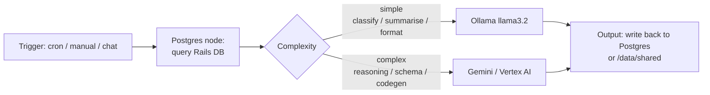

# Stack & services

> Source of truth: [docker-compose.yml](../../docker-compose.yml).
> All env vars come from a root-level `.env`; the schema is mirrored in
> [src/zefflow/config/app_config.py](../../src/zefflow/config/app_config.py).

## Services

| Service | Image | Container | Host port | Volume | Depends on |
|---|---|---|---|---|---|
| `postgres` | `postgres:17-alpine` | `n8n-postgres` | `5432` | `postgres_data` | — |
| `ollama` | `ollama/ollama:${OLLAMA_IMAGE_TAG:-latest}` | `ollama` | `127.0.0.1:11434` | `ollama_data` | — |
| `ollama-pull` | same | `ollama-pull` | — (one-shot) | — | `ollama` healthy |
| `n8n` | `n8nio/n8n:latest` | `n8n` | `5678` | `n8n_data`, bind `./shared → /data/shared` | `postgres` + `ollama` healthy |

- Network: single `dev` bridge; services address each other by service name (e.g. n8n → `postgres:5432`, n8n → `ollama:11434`).
- `ollama-pull` is a one-shot init that pulls `${DEFAULT_CHAT_MODEL:-llama3.2}` and `${DEFAULT_EMBED_MODEL:-nomic-embed-text}` then exits.
- Both n8n and Postgres have healthchecks; the user runs n8n as `1000:1000` to keep the bind-mount writable.

## LLM routing (intent — see [notes/architecture.md](../architecture.md))

The currently-exported demo workflow already embodies this pattern in miniature: `manualTrigger → postgres (list tables) → langchain.agent ⟵ lmChatGoogleGemini ⟵ memoryBufferWindow ⟵ 2 × postgresTool`.

## Env contract

`.env` (not committed; `.env.example` exists) drives everything. Notable groups, all defined with descriptions in `AppConfig`:

- **Postgres** — `POSTGRES_USER/PASSWORD/DB`, plus n8n's own `DB_POSTGRESDB_*` (n8n's DB driver is `postgresdb`, *not* `postgres`).
- **n8n security** — `N8N_ENCRYPTION_KEY` (≥32 chars), basic auth user/pass.
- **Ollama** — image tag, `OLLAMA_KEEP_ALIVE`, `OLLAMA_NUM_PARALLEL`, `OLLAMA_MAX_LOADED_MODELS`, context length, optional `OLLAMA_HOST=host.docker.internal:11434` for Mac users wanting native Metal Ollama.
- **Models** — `DEFAULT_CHAT_MODEL`, `DEFAULT_EMBED_MODEL`.
- **GCP** — `GOOGLE_CLOUD_PROJECT`, `GOOGLE_CLOUD_LOCATION` (and the `agent-workflows` package adds `LLM_PROVIDER`, `GOOGLE_API_KEY`, `DEFAULT_MODEL`, `DATABASE_URL` in its own `Settings`).

## Reality check

- The stack has been **defined** but every checkbox in [notes/architecture.md](../architecture.md) is still unchecked. There is no proof in the repo that `compose up` has succeeded end-to-end.
- [infra/Dockerfile](../../infra/Dockerfile) is **empty** — nothing builds from `infra/` yet.
- `./shared` is empty.
- The single n8n export is a demo; [notes/n8n-workflows.md](../n8n-workflows.md) explicitly says no real workflows exist.

---
*Last verified against commit `6319dfb` on 2026-05-03. Run `make repo-map-check` to detect drift; `make repo-map-rebuild` for a full refresh.*
