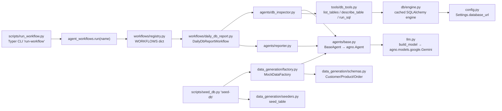

# Python package: `agent-workflows`

Path: [agent-workflows/](../../agent-workflows/) — its own `pyproject.toml`, `uv.lock`, tests. Python ≥3.12.

> ⚠️ **Just moved.** This package was lifted out of `src/agent-workflows/` in
> an uncommitted change (`git status` shows 30+ deletions there). Treat its
> location as in-flux until the move is committed.

## Role

The **agent runtime** — Agno-based agents and workflows that target Gemini (or Vertex AI). Single-line UX: `from agent_workflows import run; run("daily_db_report")`.

## Spine

## Modules

| File | Purpose |
|---|---|
| [config.py](../../agent-workflows/src/agent_workflows/config.py) | `Settings` (pydantic-settings) with `LLM_PROVIDER` toggle (`gemini`/`vertex`), `DATABASE_URL` (default `sqlite:///./dev.db`), validation that fails fast on missing creds. |
| [llm.py](../../agent-workflows/src/agent_workflows/llm.py) | `build_model()` returns an Agno-compatible Gemini model, switching to Vertex via `vertexai=True`. |
| [logging.py](../../agent-workflows/src/agent_workflows/logging.py) | `structlog` setup. |
| [workflows/base.py](../../agent-workflows/src/agent_workflows/workflows/base.py) | `BaseWorkflow` ABC + `WorkflowResult` envelope (`status`, `duration_seconds`, `output`, `error`). `run()` wraps `_execute()` with timing + structured logging. |
| [workflows/registry.py](../../agent-workflows/src/agent_workflows/workflows/registry.py) | Maps name → class. |
| [workflows/daily_db_report.py](../../agent-workflows/src/agent_workflows/workflows/daily_db_report.py) | The single demo workflow: `DbInspectorAgent` → findings → `ReporterAgent` → markdown report. |
| [agents/base.py](../../agent-workflows/src/agent_workflows/agents/base.py) | `BaseAgent` thin wrapper: subclasses set class-level `role`, `instructions`, `tools`. `run(prompt)` returns text; `run_structured(prompt, response_model)` returns a parsed pydantic model. |
| [agents/db_inspector.py](../../agent-workflows/src/agent_workflows/agents/db_inspector.py) | Read-only DB inspector wired to `db_tools`. |
| [agents/reporter.py](../../agent-workflows/src/agent_workflows/agents/reporter.py) | Turns findings into an exec-style markdown report. |
| [tools/db_tools.py](../../agent-workflows/src/agent_workflows/tools/db_tools.py) | `list_tables`, `describe_table`, `run_sql` (with a *basic* keyword-blacklist guard against writes/DDL). |
| [db/engine.py](../../agent-workflows/src/agent_workflows/db/engine.py) | `@cache`d `create_engine(settings.database_url, future=True)` + `init_db()`. |
| [db/models.py](../../agent-workflows/src/agent_workflows/db/models.py) | Sample ORM: `CustomerORM`, `ProductORM`, `OrderORM`. **Different `Base` and totally different schema** to `zefflow.db.db_models`. |
| [data_generation/factory.py](../../agent-workflows/src/agent_workflows/data_generation/factory.py) | `MockDataFactory.generate(schema, n, context)` — uses an internal Agno agent to produce a `RootModel[list[schema]]` JSON response. |
| [data_generation/schemas.py](../../agent-workflows/src/agent_workflows/data_generation/schemas.py) | `Customer`, `Product`, `Order` pydantic schemas. |
| [data_generation/seeders.py](../../agent-workflows/src/agent_workflows/data_generation/seeders.py) | `seed_table(name, rows)` — autoload the table, bulk-insert pydantic rows. |

## Entrypoints

| Command | Target | What it does |
|---|---|---|
| `run-workflow` | [`scripts.run_workflow:app`](../../agent-workflows/scripts/run_workflow.py) | Typer + rich UI. Runs a registered workflow, pretty-prints status + duration, renders the markdown `report` if present. |
| `seed-db` | [`scripts.seed_db:app`](../../agent-workflows/scripts/seed_db.py) | `init_db()`, then LLM-generates customers / products / orders and `seed_table()`s them. |

## Tests

[tests/test_smoke.py](../../agent-workflows/tests/test_smoke.py): registry contains `daily_db_report`, all registered classes subclass `BaseWorkflow`, `WorkflowResult` constructs, unknown workflow raises `KeyError`. **No LLM calls, no DB.**

## Key facts

- Strict mypy + ruff configured (`pyproject.toml`).
- `agno` is unpinned (`>=1.1.0`); see `tickets.json` TICKET-2 — version drift is a known risk.
- Provider-agnostic by design: flip `LLM_PROVIDER` between `gemini` (API key) and `vertex` (ADC + project).

## What it does *not* do (yet)

- Touch the Compose Postgres or any Rails DB by default — `database_url` defaults to **SQLite** (`./dev.db`).
- Integrate with `zefflow` at all.
- Have any non-smoke tests.
